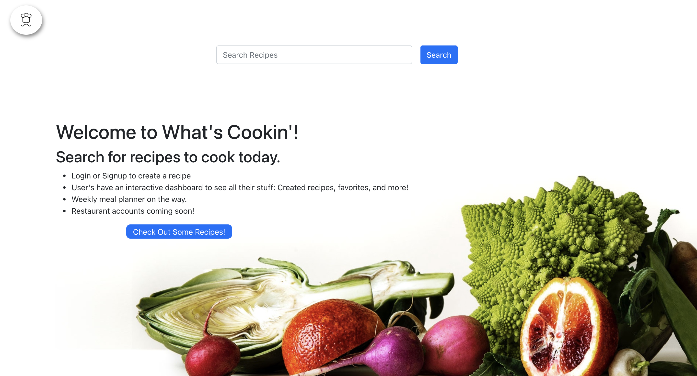
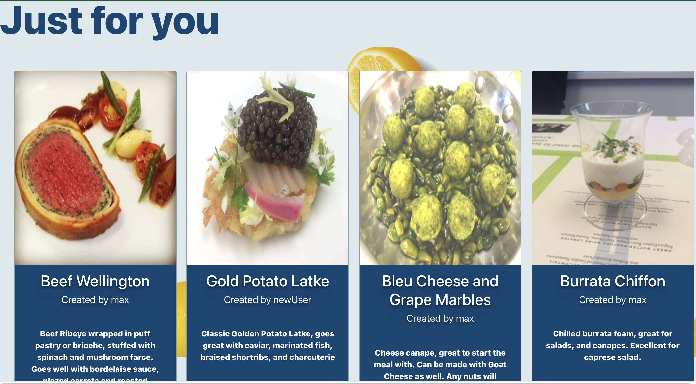
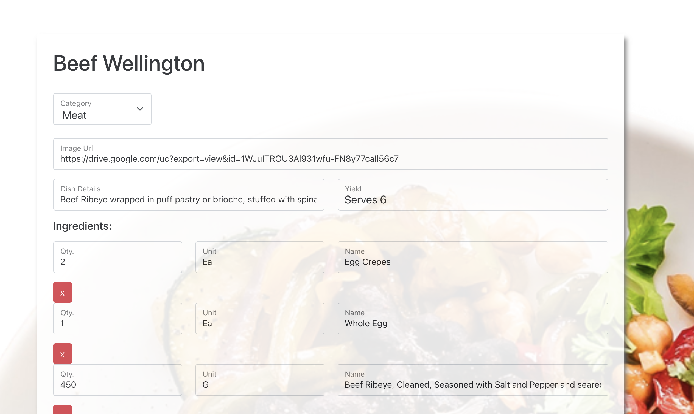
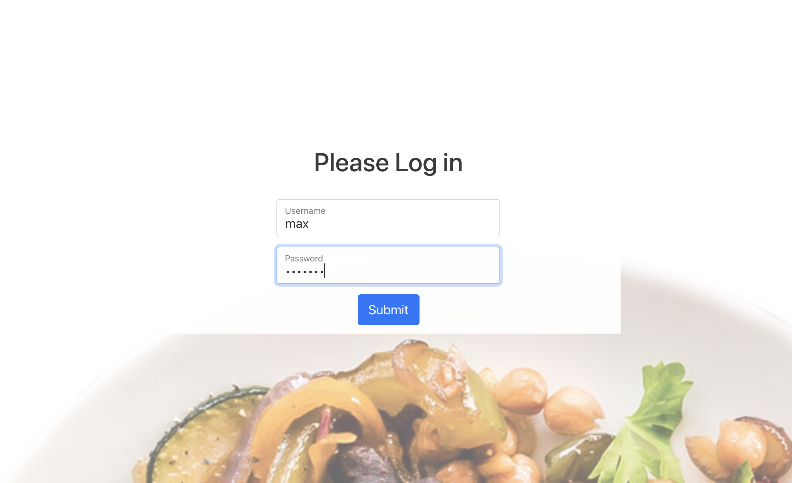
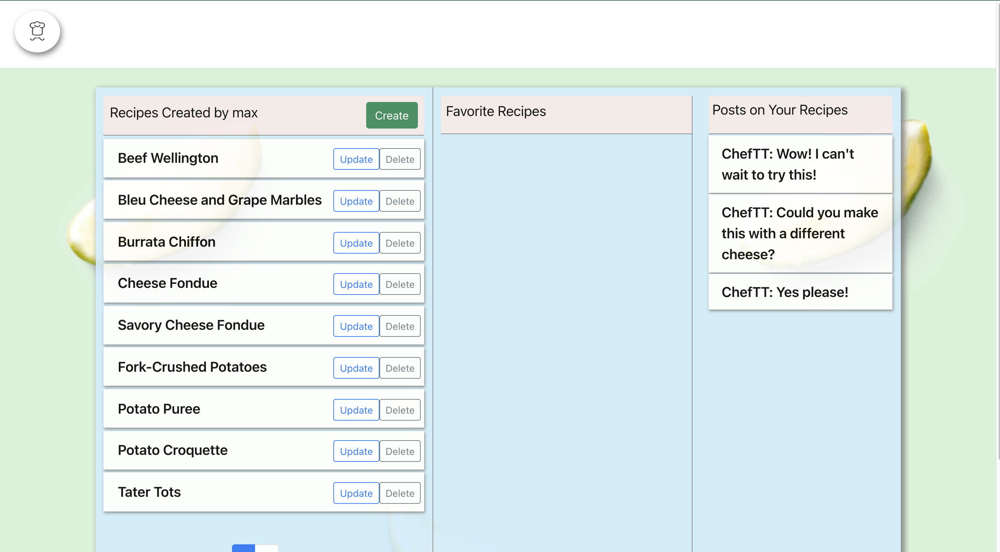
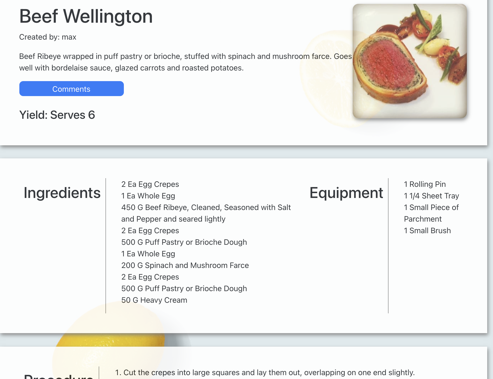

# What's Cookin' Recipe Database

## This is a site that gives users the opportunity to store their favorite recipes in one place with a dynamic recipe form and database. They can also connect with other users by answering questions or commenting on others' recipes. 

## [Test the Site out here!](https://whatscookindb.herokuapp.com/)

-----
## This app does not need to be installed
-----
# User Stories
### As a user:

- I want to be able to see exciting, new recipes to try on my feed.
- I want to be able to preserve all of my recipes that I have written down, and organize them all in one place
- I want to be able to post tips and secrets that might help other users when cooking recipes.
- I want to be able to comment on other users posts and help answer questions that they may have.

-----
# ScreenShots

### Home Page


### Recipe View Home Page



### Recipe Form



### Login



### Dashboard



### Recipe Detail



-------
# Stack

- Django Stack
- Django REST Framework
- Hashlinks
- React-Bootstrap
- Axios

------
# Models

- Recipe 
    - title
    - user
- Recipe Body
    - title
    - image_url
    - dish_components
    - recipe_yield
    - category
- Ingredients
    - quantity
    - unit_of_measure
    - name
    - recipe
- Equipment
    - quantity
    - name
    - recipe
- Procedure
    - step
    - recipe
- Users(AbstractUser)
    - first_name
    - last_name
    - everything else that comes with Abstract User
- Posts
    - user
    - recipe
    - body
    - created_date
    - created_time
- Comments
    - user
    - body
    - post
    - created_date
    - created_time
-------
# WireFrames

### Home Page


### Form


### Recipe Detail


### Dashboard


------
# Sample Data

```json
{
        "id": 4,
        "title": "Bleu Cheese and Grape Marbles",
        "recipe_post": [
            {
                "user": "ChefTT",
                "recipe": 4,
                "body": "Could you make this with a different cheese?",
                "id": 5,
                "created_date": "2021-10-03",
                "created_time": "18:50:05.528239",
                "comments": []
            }
        ],
        "recipe_body": [
            {
                "id": 6,
                "image": null,
                "image_url": "https://drive.google.com/uc?export=view&id=17xT0vZDFpXMBVz9GoFNzavgke7vYYMEB",
                "dish_components": "Cheese canape, great to start the meal with. Can be made with Goat Cheese as well. Any nuts will work, pistachios are pictured.",
                "recipe_yield": "100 ea",
                "category": "Cheese",
                "title": 4
            }
        ],
        "user": "max",
        "ingredients": [
            {
                "id": 20,
                "name": "Bleu Cheese, rind removed, diced, room temperature.",
                "quantity": 1.0,
                "unit_of_measure": "K",
                "recipe": 4
            },
            {
                "id": 21,
                "name": "Heavy Cream",
                "quantity": 100.0,
                "unit_of_measure": "G",
                "recipe": 4
            },
            {
                "id": 22,
                "name": "Gelatin Sheets, bloomed",
                "quantity": 10.0,
                "unit_of_measure": "Ea",
                "recipe": 4
            },
            {
                "id": 23,
                "name": "Red Thompson Grapes, small",
                "quantity": 6.0,
                "unit_of_measure": "G",
                "recipe": 4
            },
            {
                "id": 24,
                "name": "Nuts, Finely Ground",
                "quantity": 1.0,
                "unit_of_measure": "Qt.",
                "recipe": 4
            }
        ],
        "equipment": [
            {
                "id": 13,
                "name": "Medium mixing bowl",
                "quantity": 1,
                "recipe": 4
            },
            {
                "id": 14,
                "name": "Full Sheet Pans",
                "quantity": 2,
                "recipe": 4
            },
            {
                "id": 15,
                "name": "Medium Round Cutter (50mm)",
                "quantity": 1,
                "recipe": 4
            },
            {
                "id": 16,
                "name": "Containers for Storage",
                "quantity": 2,
                "recipe": 4
            }
        ],
        "procedure": [
            {
                "id": 22,
                "step": "Bring the cream to a boil, add the gelatin and salt and stir to incorporate; let the cream mixture cool slightly.",
                "recipe": 4
            },
            {
                "id": 23,
                "step": "Pour the warm cream mixture over the bleu cheese.",
                "recipe": 4
            },
            {
                "id": 24,
                "step": "Using a glove, mix the cheese and cream until homogenous (be careful not to over mix or the integrity of the cheese will be lost).",
                "recipe": 4
            },
            {
                "id": 25,
                "step": "Roll the cheese mixture between two pieces of parchment paper to approximately 1/8th of an inch. Refrigerate on the sheet trays until set.",
                "recipe": 4
            },
            {
                "id": 26,
                "step": "Using the round cutter, punch out circles of the cheese.",
                "recipe": 4
            },
            {
                "id": 27,
                "step": "Working with one grap at a time, place a round of bleu cheese over each grape and roll the cheese around until the grape is fully wrapped and the shape of a marble.",
                "recipe": 4
            },
            {
                "id": 28,
                "step": "Place the finely ground nuts in a clean mixing bowl and add the grapes a few at a time. Roll them around until they are evenly coated.",
                "recipe": 4
            },
            {
                "id": 29,
                "step": "Roll the marbles a final time to ensure the nuts are packed in.",
                "recipe": 4
            },
            {
                "id": 30,
                "step": "Transfer to containers for storage or serve immediately.",
                "recipe": 4
            },
            {
                "id": 31,
                "step": "Place the bleu cheese in the medium mixing bowl and allow it to come to room temperature.",
                "recipe": 4
            }
        ]
    },
```

# CRUD Actions

- Create, Update, Read, Delete Recipes
- Create Users, Update Created Recipes per user, Read Created Recipes per User
- Create, Update, Read, Delete Posts and Comments

# Major Hurdles

The biggest hurdle I faced while making this project was wrapping my head around the data structure that I had in my head and being able to apply that to Django. The biggest lesson that I learned is that documentation is the greatest resource when building a project like this. I was able to achieve more that I thought possible because I took the time to familiarize myself with the documentation. The second biggest hurdle I ran into in this project was the logic of the front-end form. Every time I thought I had it the way I wanted, a new bug would pop up. It taught me a valuable lesson about thinking things through and planning moves out before diving into the code. Overall this has been a great project, and and invaluable learning experience.

# Stretch Goals - work in progress

- Incorporate an Articles/Forum section where users can make blog style posts.
- Give users the ability to scan their old recipes and upload them to their dashboard.
- Incorporate a calendar package that allows users to plan meals.
- Allow users to upload videos of recipes being cooked, and then have a feed that shows all the videos.
- Restaurant account- different permissions.
- Task list for restaurant account.
- Restaurant admin account, can invite and remove users from seeing their recipes.

# Sources 

- [React-Bootstrap](https://react-bootstrap.github.io/)
- [React Router Hashlinks](https://www.npmjs.com/package/react-router-hash-link)
- [JWT-Authentication Tutorial](https://hackernoon.com/110percent-complete-jwt-authentication-with-django-and-react-2020-iejq34ta)
- [Django REST Framework Docs](https://www.django-rest-framework.org/)
- [CSS-Tricks](https://css-tricks.com/)